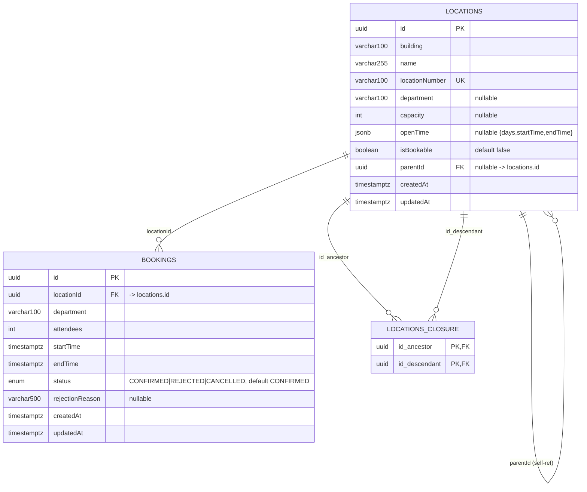

# Database Design

PostgreSQL 16. All timestamp columns are `timestamptz` and the server runs in
UTC (`TZ=UTC`, `PGTZ=UTC`). Schema is created and evolved exclusively through
TypeORM migrations (`synchronize: false`).

## ER diagram



## Tables

### `locations`

| Column         | Type         | Constraints                                                          |
| -------------- | ------------ | -------------------------------------------------------------------- |
| id             | uuid         | PK, default `uuid_generate_v4()`                                     |
| building       | varchar(100) | NOT NULL                                                             |
| name           | varchar(255) | NOT NULL                                                             |
| locationNumber | varchar(100) | NOT NULL, **UNIQUE**                                                 |
| department     | varchar(100) | NULL (set only on bookable rooms)                                    |
| capacity       | int          | NULL (set only on bookable rooms)                                    |
| openTime       | jsonb        | NULL — `{ days: DayOfWeek[], startTime: "HH:mm", endTime: "HH:mm" }` |
| isBookable     | boolean      | NOT NULL, default `false`                                            |
| parentId       | uuid         | NULL, FK → `locations.id` `ON DELETE RESTRICT`                       |
| createdAt      | timestamptz  | NOT NULL, default `now()`                                            |
| updatedAt      | timestamptz  | NOT NULL, default `now()`                                            |

Indexes:

- `PK` on `id`
- `UQ_location_locationNumber` — UNIQUE on `locationNumber` (human-readable code)
- FK index on `parentId` (self-reference)

The self FK is `ON DELETE RESTRICT`; combined with the service-level guard, a
node with children cannot be deleted (returns `409`).

### `locations_closure` (closure-table, managed by TypeORM)

| Column        | Type | Constraints                                             |
| ------------- | ---- | ------------------------------------------------------- |
| id_ancestor   | uuid | PK (composite), FK → `locations.id` `ON DELETE CASCADE` |
| id_descendant | uuid | PK (composite), FK → `locations.id` `ON DELETE CASCADE` |

Holds every ancestor→descendant pair (incl. self). Indexed on both
`id_ancestor` and `id_descendant` for efficient subtree / ancestor queries.

### `bookings`

| Column          | Type         | Constraints                                                        |
| --------------- | ------------ | ------------------------------------------------------------------ |
| id              | uuid         | PK, default `uuid_generate_v4()`                                   |
| locationId      | uuid         | NOT NULL, FK → `locations.id` `ON DELETE CASCADE`                  |
| department      | varchar(100) | NOT NULL                                                           |
| attendees       | int          | NOT NULL                                                           |
| startTime       | timestamptz  | NOT NULL                                                           |
| endTime         | timestamptz  | NOT NULL                                                           |
| status          | enum         | NOT NULL, default `CONFIRMED` (`CONFIRMED`/`REJECTED`/`CANCELLED`) |
| rejectionReason | varchar(500) | NULL                                                               |
| createdAt       | timestamptz  | NOT NULL, default `now()`                                          |
| updatedAt       | timestamptz  | NOT NULL, default `now()`                                          |

Indexes:

- `PK` on `id`
- `IDX_booking_location_time` — composite on `(locationId, startTime, endTime)`
  to support the overlap query (`status=CONFIRMED AND start < :end AND end > :start`).

The `locationId` FK is `ON DELETE CASCADE`: deleting a location removes its
booking rows. In practice the service blocks deletion while any **CONFIRMED**
booking exists (`409`), so only historical `CANCELLED`/`REJECTED` rows are ever
cascaded away.

## `openTime` JSON shape

```json
{
  "days": ["MON", "TUE", "WED", "THU", "FRI"],
  "startTime": "09:00",
  "endTime": "18:00"
}
```

Stored as `jsonb` instead of a raw string like "Mon to Fri (9AM to 6PM)" so it
can be validated programmatically (`OpenTimeDto` with class-validator) and
queried by the booking time-validation logic.
